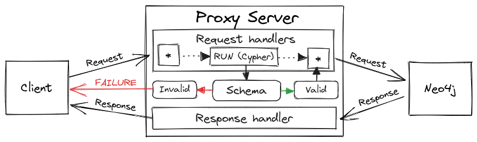

# graph-guard

[](https://github.com/c-fraser/graph-guard/actions)
[](https://github.com/c-fraser/graph-guard/releases)
[](https://search.maven.org/search?q=g:io.github.c-fraser%20AND%20a:graph-guard)
[](https://javadoc.io/doc/io.github.c-fraser/graph-guard)
[](https://www.apache.org/licenses/LICENSE-2.0)

`graph-guard` is an extensible [Bolt](https://neo4j.com/docs/bolt/current/bolt/) proxy server
for [Neo4j](https://neo4j.com/) 5+ (compatible databases).

<!--- TOC -->

* [Design](#design)
* [Plugins](#plugins)
  * [Query validation](#query-validation)
    * [Schema](#schema)
    * [Graph](#graph)
    * [Nodes](#nodes)
    * [Relationships](#relationships)
    * [Properties](#properties)
    * [Violations](#violations)
    * [Grammar](#grammar)
  * [Scripting](#scripting)
* [Usage](#usage)
  * [Documentation](#documentation)
  * [CLI](#cli)
* [License](#license)

<!--- END -->

## Design

The [Server](https://c-fraser.github.io/graph-guard/api/graph-guard/io.github.cfraser.graphguard/-server/index.html)
proxies [Bolt](https://c-fraser.github.io/graph-guard/api/graph-guard/io.github.cfraser.graphguard/-bolt/index.html)
messages as displayed in the diagram below.



Proxied messages are intercepted by
the [Plugin](https://c-fraser.github.io/graph-guard/api/graph-guard/io.github.cfraser.graphguard/-server/-plugin/index.html),
enabling
the [Server](https://c-fraser.github.io/graph-guard/api/graph-guard/io.github.cfraser.graphguard/-server/index.html)
to dynamically transform the incoming and outgoing data.

## Plugins

`graph-guard-plugins` contains
various [Plugin](https://c-fraser.github.io/graph-guard/api/graph-guard/io.github.cfraser.graphguard/-server/-plugin/index.html)
implementations to
augment [Server](https://c-fraser.github.io/graph-guard/api/graph-guard/io.github.cfraser.graphguard/-server/index.html)
functionality.

### Query validation

[Schema.Validator](https://c-fraser.github.io/graph-guard/api/plugins/graph-guard-plugins/io.github.cfraser.graphguard.plugin/-schema/-validator/index.html)
is a [plugin](#plugins) that performs realtime [schema](#schema) validation by
intercepting [RUN](https://c-fraser.github.io/graph-guard/api/graph-guard/io.github.cfraser.graphguard/-bolt/-run/index.html)
requests then analyzing the [Cypher](https://neo4j.com/developer/cypher/) query (and parameters) for
schema [violations](#violations). If the intercepted query is determined to be *invalid* according
to the schema, then
a [FAILURE](https://c-fraser.github.io/graph-guard/api/graph-guard/io.github.cfraser.graphguard/-bolt/-failure/index.html)
response is sent to the *client*.

For example, validate [movies](https://github.com/neo4j-graph-examples/movies) queries via
the [Server](#design), using the [graph-guard](#usage) libraries.

<!--- INCLUDE
import org.neo4j.driver.AuthTokens
import org.neo4j.driver.Config
import org.neo4j.driver.GraphDatabase
import org.neo4j.driver.exceptions.DatabaseException
-->

[//]: # (@formatter:off)
```kotlin
fun runInvalidMoviesQueries(password: String) {
    GraphDatabase.driver(
          "bolt://localhost:8787",
          AuthTokens.basic("neo4j", password),
          Config.builder().withoutEncryption().build()).use { driver ->
    driver.session().use { session ->
      /** Run the invalid [query] and print the schema violation message. */
      fun run(query: String) {
        try {
          session.run(query)
          error("Expected schema violation for query '$query'")
        } catch (exception: DatabaseException) {
          println(exception.message)
        }
      }
      run("CREATE (:TVShow {title: 'The Office', released: 2005})")
      run("MATCH (theMatrix:Movie {title: 'The Matrix'}) SET theMatrix.budget = 63000000")
      run("MERGE (:Person {name: 'Chris Fraser'})-[:WATCHED]->(:Movie {title: 'The Matrix'})")
      run("MATCH (:Person)-[produced:PRODUCED]->(:Movie {title: 'The Matrix'}) SET produced.studio = 'Warner Bros.'")
      run("CREATE (Keanu:Person {name: 'Keanu Reeves', born: '09/02/1964'})")
    }
  }
}
```
[//]: # (@formatter:on)

<!--- KNIT Example01.kt -->
<!--- TEST_NAME Example02Test --> 
<!--- INCLUDE
import io.github.cfraser.graphguard.plugin.Schema
import io.github.cfraser.graphguard.Server
import io.github.cfraser.graphguard.withNeo4j
import java.net.URI
import kotlin.concurrent.thread

fun runExample02() {
  withNeo4j {
----- SUFFIX
  }
}
-->

[//]: # (@formatter:off)
```kotlin
val proxy = thread {
  try {
    Server(URI(boltUrl), Schema(MOVIES_SCHEMA).Validator()).run()
  } catch (_: InterruptedException) {}
}
Thread.sleep(1_000) // Wait for the proxy server to initialize
runInvalidMoviesQueries(adminPassword)
proxy.interrupt()
```
[//]: # (@formatter:on)

<!--- KNIT Example02.kt --> 

The code above prints the following *schema violation* messages.

```text
Unknown node TVShow
Unknown property 'budget' for node Movie
Unknown relationship WATCHED from Person to Movie
Unknown property 'studio' for relationship PRODUCED from Person to Movie
Invalid query value(s) '09/02/1964' for property 'born: Integer' on node Person
```

<!--- TEST -->

#### Schema

A schema describes the nodes and relationships in a graph. The schema is defined
using a custom DSL language, demonstrated below for
the [movies](https://github.com/neo4j-graph-examples/movies) graph.

<!--- INCLUDE
/** The schema DSL for the *movies* graph. */
const val MOVIES_SCHEMA =
    """
----- SUFFIX
"""
-->

[//]: # (@formatter:off)
```kotlin
graph Movies {
  node Person(name: String, born: Integer):
    ACTED_IN(roles: List<String>) -> Movie,
    DIRECTED -> Movie,
    PRODUCED -> Movie,
    WROTE -> Movie,
    REVIEWED(summary: String, rating: Integer) -> Movie;
  node Movie(title: String, released: Integer, tagline: String);
}
```
[//]: # (@formatter:on)
<!--- KNIT Example03.kt --> 

#### Graph

A `graph` contains [node statements](#nodes). A [schema](#schema) may include multiple
interconnected [graphs](#graph). To reference a *node* in another *graph*, qualify the *node* name
with the *graph* name, as shown below.

<!--- INCLUDE
const val PLACES_SCHEMA =
    """
----- SUFFIX
"""
-->

[//]: # (@formatter:off)
```kotlin
graph Places {
  node Theater(name: String):
    SHOWING(times: List<Integer>) -> Movies.Movie;
}
```
[//]: # (@formatter:on)
<!--- KNIT Example04.kt --> 

#### Nodes

A `node` must have a unique name, and may
have [properties](#properties) and/or [relationship definitions](#relationships).

#### Relationships

Relationships are defined relative to the *source* [node](#nodes). A relationship definition must
have a name, direction (`->` for directed, or `--` for undirected), and target node. A relationship
must have a unique `(source)-[name]-(target)`, and may also have [properties](#properties).

#### Properties

A node or relationship may have *typed* properties. The supported property types are listed below.

> The types align with the
> supported [Cypher values](https://neo4j.com/docs/cypher-manual/current/values-and-types/).

- `Any` - a dynamically typed property
- `Boolean`
- `Date` - a
  [date()](https://neo4j.com/docs/cypher-manual/current/functions/temporal/#functions-date)
- `DateTime` -
  a [datetime()](https://neo4j.com/docs/cypher-manual/current/functions/temporal/#functions-datetime)
- `Duration` -
  a [duration()](https://neo4j.com/docs/cypher-manual/current/functions/temporal/duration/)
- `Float`
- `Integer`
- `List<T>` - where `T` is another (un-parameterized) supported type
- `LocalDateTime` -
  a [localdatetime()](https://neo4j.com/docs/cypher-manual/current/functions/temporal/#functions-localdatetime)
- `LocalTime` -
  a [localtime()](https://neo4j.com/docs/cypher-manual/current/functions/temporal/#functions-localtime)
- `String`
- `Time` -
  a [time()](https://neo4j.com/docs/cypher-manual/current/functions/temporal/#functions-time)

A property can be designated as nullable by including the `?` suffix on the type, for
example `String?` and `List<Any?>`.

#### Violations

The Cypher query validation prevents the following [schema](#schema) violations.

- `"Unknown ${entity}"` - a query has a node or relationship not defined in the schema
- `"Unknown property '${property}' for ${entity}"` - a query has a property (on a node or
  relationship) not defined in the schema
- `"Invalid query value(s) '${values}' for property '${property}' on ${entity}"` - a query has
  property value(s) (on a node or relationship) conflicting with the type defined in the schema

#### Grammar

Refer to
the ([antlr4](https://github.com/antlr/antlr4))
[grammar](https://github.com/c-fraser/graph-guard/blob/main/src/main/antlr/Schema.g4)
for an exact specification of the [schema](#schema) DSL.

### Scripting

[Script.evaluate](https://c-fraser.github.io/graph-guard/api/plugins/graph-guard-plugins/io.github.cfraser.graphguard.plugin/-script/-companion/evaluate.html)
enables [plugins](#plugins) to be compiled and loaded from
a [Kotlin script](https://kotlinlang.org/docs/custom-script-deps-tutorial.html).
The [Script.Context](https://c-fraser.github.io/graph-guard/api/plugins/graph-guard-plugins/io.github.cfraser.graphguard.plugin/-script/-context/index.html)
exposes
a [DSL](https://c-fraser.github.io/graph-guard/api/graph-guard/io.github.cfraser.graphguard/-server/-plugin/-d-s-l/index.html)
to build [plugins](#plugins).

For example, use a [plugin script](#scripting) with the [Server](#design).

<!--- TEST_NAME Example05Test --> 
<!--- INCLUDE
import io.github.cfraser.graphguard.Server
import io.github.cfraser.graphguard.plugin.Script
import io.github.cfraser.graphguard.runMoviesQueries
import io.github.cfraser.graphguard.withNeo4j
import java.net.URI
import kotlin.concurrent.thread

fun runExample05() {
  withNeo4j {
----- SUFFIX
  }
}
-->

[//]: # (@formatter:off)
```kotlin
val script = """
@file:DependsOn(
    "io.github.resilience4j:resilience4j-ratelimiter:2.2.0",
    "io.github.resilience4j:resilience4j-kotlin:2.2.0")

import io.github.resilience4j.kotlin.ratelimiter.RateLimiterConfig
import io.github.resilience4j.kotlin.ratelimiter.executeSuspendFunction
import io.github.resilience4j.ratelimiter.RateLimiter
import java.util.concurrent.atomic.AtomicInteger

plugin {
  val rateLimiter = RateLimiter.of("message-limiter", RateLimiterConfig {})
  intercept { message -> rateLimiter.executeSuspendFunction { message } }
}

plugin { 
  val messages = AtomicInteger()
  intercept { message ->
    if (messages.getAndIncrement() == 0) println(message::class.simpleName)
    message
  }
}
"""
val proxy = thread {
  try {
    Server(URI(boltUrl), Script.evaluate(script)).run()
  } catch (_: InterruptedException) {}
}
Thread.sleep(10_000) // Wait for the proxy server to initialize
runMoviesQueries(adminPassword)
proxy.interrupt()
```
[//]: # (@formatter:on)

> Script compilation and evaluation takes longer, thus the 10 second `Thread.sleep`.

<!--- KNIT Example05.kt --> 

The code above prints the following message.

```text
Hello
```

<!--- TEST -->

## Usage

The `graph-guard` libraries are accessible
via [Maven Central](https://search.maven.org/search?q=g:io.github.c-fraser%20AND%20a:graph-guard*)
and the `graph-guard-cli` application is published in
the [releases](https://github.com/c-fraser/graph-guard/releases).

> `graph-guard` requires Java 17+.

> `Server` doesn't currently support TLS (because
> of [ktor-network](https://youtrack.jetbrains.com/issue/KTOR-694) limitations).
> Use [NGINX](https://docs.nginx.com/nginx/admin-guide/security-controls/terminating-ssl-tcp/) or a
> cloud load balancer to decrypt *Bolt* traffic for the proxy server.

### Documentation

Refer to the [graph-guard](https://c-fraser.github.io/graph-guard/api/)
and [graph-guard-plugins](https://c-fraser.github.io/graph-guard/api/plugins/) code
documentation.

### CLI

Download and run the `graph-guard-cli` application.

```shell
curl -OL https://github.com/c-fraser/graph-guard/releases/latest/download/graph-guard-app-shadow.tar
tar -xvf graph-guard-cli-shadow.tar
./graph-guard-cli-shadow/bin/graph-guard-cli --help
```

> Refer to the [demo](https://c-fraser.github.io/graph-guard/cli/)
> (and [source script](https://github.com/c-fraser/graph-guard/blob/main/cli/demo.sh)).

## License

    Copyright 2023 c-fraser
    
    Licensed under the Apache License, Version 2.0 (the "License");
    you may not use this file except in compliance with the License.
    You may obtain a copy of the License at
    
        https://www.apache.org/licenses/LICENSE-2.0
    
    Unless required by applicable law or agreed to in writing, software
    distributed under the License is distributed on an "AS IS" BASIS,
    WITHOUT WARRANTIES OR CONDITIONS OF ANY KIND, either express or implied.
    See the License for the specific language governing permissions and
    limitations under the License.
