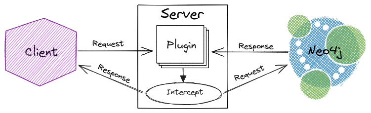

# graph-guard

[](https://github.com/c-fraser/graph-guard/actions)
[](https://github.com/c-fraser/graph-guard/releases)
[](https://search.maven.org/search?q=g:io.github.c-fraser%20AND%20a:graph-guard)
[](https://javadoc.io/doc/io.github.c-fraser/graph-guard)
[](https://www.apache.org/licenses/LICENSE-2.0)

`graph-guard` is a [Bolt](https://neo4j.com/docs/bolt/current/bolt/) proxy server that performs
realtime schema validation for [Neo4j](https://neo4j.com/) 5+ (compatible databases).

<!--- TOC -->

* [Design](#design)
    * [Server](#server)
    * [Schema](#schema)
        * [Graph](#graph)
        * [Nodes](#nodes)
        * [Relationships](#relationships)
        * [Properties](#properties)
        * [Violations](#violations)
        * [Grammar](#grammar)
* [Usage](#usage)
* [Examples](#examples)
    * [Library](#library)
    * [CLI](#cli)
* [License](#license)

<!--- END -->

## Design

### Server

The proxy `Server` proxies [Bolt messages](https://neo4j.com/docs/bolt/current/bolt/message/) as
displayed in the diagram below.



Incoming requests are dispatched to the *handler* specific to
the received [Bolt message](https://neo4j.com/docs/bolt/current/bolt/message/). [Schema](#schema)
validation is performed by
intercepting [RUN](https://neo4j.com/docs/bolt/current/bolt/message/#messages-run) requests and
analyzing the [Cypher](https://neo4j.com/developer/cypher/) query (and parameters) for schema
[violations](#violations). If the intercepted query is determined to be *invalid* according to the
schema, then
a [FAILURE](https://neo4j.com/docs/bolt/current/bolt/message/#messages-failure) response is sent to
the *client*.

### Schema

A schema describes the nodes and relationships in a graph. The schema is defined
using `graph-guard`'s DSL language, demonstrated below for
the [movies](https://github.com/neo4j-graph-examples/movies) graph.

<!--- INCLUDE
import io.github.cfraser.graphguard.MOVIES_GRAPH

/** The schema DSL for the [MOVIES_GRAPH]. */
const val MOVIES_SCHEMA =
    """
----- SUFFIX
"""
-->

[//]: # (@formatter:off)
```kotlin
graph Movies {
  node Person(name: String, born: Integer):
    ACTED_IN(roles: List<String>) -> Movie,
    DIRECTED -> Movie,
    PRODUCED -> Movie,
    WROTE -> Movie,
    REVIEWED(summary: String, rating: Integer) -> Movie;

  node Movie(title: String, released: Integer, tagline: String);
}
```
[//]: # (@formatter:on)
<!--- KNIT Example01.kt --> 

#### Graph

A `graph` contains [node statements](#nodes). A [schema](#schema) may include multiple
interconnected [graphs](#graph). To reference a *node* in another *graph*, qualify the *node* name
with the *graph* name, as shown below.

<!--- INCLUDE
const val PLACES_SCHEMA =
    """
----- SUFFIX
"""
-->

[//]: # (@formatter:off)
```kotlin
graph Places {
  node Theater(name: String):
    SHOWING(times: List<Integer>) -> Movies.Movie;
}
```
[//]: # (@formatter:on)
<!--- KNIT Example02.kt --> 

#### Nodes

A `node` must have a unique name, and may
have [properties](#properties) and/or [relationship definitions](#relationships).

#### Relationships

Relationships are defined relative to the *source* [node](#nodes). A relationship definition must
have a name, direction (`->` for directed, or `--` for undirected), and target node, and may also
have [properties](#properties). A relationship must have a unique *name* + *source* + *target*.

#### Properties

A node or relationship may have *typed* properties. The supported property types are listed below.

> The types align with the
> supported [Cypher values](https://neo4j.com/docs/cypher-manual/current/values-and-types/).

- `Any` - a dynamically typed property
- `Boolean`
- `Date` - a
  [date()](https://neo4j.com/docs/cypher-manual/current/functions/temporal/#functions-date)
- `DateTime` -
  a [datetime()](https://neo4j.com/docs/cypher-manual/current/functions/temporal/#functions-datetime)
- `Duration` -
  a [duration()](https://neo4j.com/docs/cypher-manual/current/functions/temporal/duration/)
- `Float`
- `Integer`
- `List<T>` - where `T` is another (un-parameterized) supported type
- `LocalDateTime` -
  a [localdatetime()](https://neo4j.com/docs/cypher-manual/current/functions/temporal/#functions-localdatetime)
- `LocalTime` -
  a [localtime()](https://neo4j.com/docs/cypher-manual/current/functions/temporal/#functions-localtime)
- `String`
- `Time` -
  a [time()](https://neo4j.com/docs/cypher-manual/current/functions/temporal/#functions-time)

A property can be designated as nullable by including the `?` suffix on the type, for
example `String?` and `List<Any?>`.

#### Violations

The [server](#server)'s the *Cypher* query validation checks for and prevents the
following [schema](#schema) violations.

- `"Unknown ${entity}"` - a query has a node or relationship not defined in the schema
- `"Unknown property '${property}' for ${entity}"` - a query has a property (on a node or
  relationship) not defined in the schema
- `"Invalid query value(s) '${values}' for property '${property}' on ${entity}"` - a query has
  property value(s) (on a node or relationship) conflicting with the type defined in the schema

#### Grammar

Refer to
the ([antlr4](https://github.com/antlr/antlr4))
[grammar](https://github.com/c-fraser/graph-guard/blob/main/src/main/antlr/Schema.g4)
for an exact specification of the [schema](#schema) DSL.

## Usage

The `graph-guard` library is accessible
via [Maven Central](https://search.maven.org/search?q=g:io.github.c-fraser%20AND%20a:graph-guard)
and the `graph-guard-cli` application is published in
the [releases](https://github.com/c-fraser/graph-guard/releases).

> `graph-guard` requires Java 17+.

> `graph-guard` doesn't currently support TLS (because
> of [ktor-network](https://youtrack.jetbrains.com/issue/KTOR-694) limitations).
> Use [NGINX](https://docs.nginx.com/nginx/admin-guide/security-controls/terminating-ssl-tcp/) or a
> cloud load balancer to decrypt *Bolt* traffic for the proxy server.

## Examples

### Library

<!--- TEST_NAME Example03Test --> 
<!--- INCLUDE
import io.github.cfraser.graphguard.Schema
import io.github.cfraser.graphguard.Server
import io.github.cfraser.graphguard.withNeo4j
import org.neo4j.driver.AuthTokens
import org.neo4j.driver.GraphDatabase
import org.neo4j.driver.exceptions.DatabaseException
import java.net.URI
import kotlin.concurrent.thread
import kotlin.time.Duration.Companion.seconds

fun runExample03() {
  withNeo4j {
----- SUFFIX
  }
}
-->

Using the `graph-guard` library, validate [movies](https://github.com/neo4j-graph-examples/movies)
queries via the [Bolt proxy server](#server).

[//]: # (@formatter:off)
```kotlin
val proxy = thread {
  try {
    Server.create("localhost", 8787, URI(boltUrl), Schema.parse(MOVIES_SCHEMA)).run()
  } catch (_: InterruptedException) {}
}
Thread.sleep(3.seconds.inWholeMilliseconds) // Wait for the proxy server to initialize
GraphDatabase.driver("bolt://localhost:8787", AuthTokens.basic("neo4j", adminPassword)).use { driver ->
  driver.session().use { session ->
    /** Run the invalid [query] and print the schema violation message. */
    fun run(query: String) {
      try {
        session.run(query)
        error("Expected schema violation for query '$query'")
      } catch (exception: DatabaseException) {
        println(exception.message)
      }
    }
    run("CREATE (:TVShow {title: 'The Office', released: 2005})")
    run("MATCH (theMatrix:Movie {title: 'The Matrix'}) SET theMatrix.budget = 63000000")
    run("MERGE (:Person {name: 'Chris Fraser'})-[:WATCHED]->(:Movie {title: 'The Matrix'})")
    run("MATCH (:Person)-[produced:PRODUCED]->(:Movie {title: 'The Matrix'}) SET produced.studio = 'Warner Bros.'")
    run("CREATE (Keanu:Person {name: 'Keanu Reeves', born: '09/02/1964'})")
  }
}
proxy.interrupt()
```
[//]: # (@formatter:on)

<!--- KNIT Example03.kt --> 

The code above prints the following *schema violation* messages.

```text
Unknown node TVShow
Unknown property 'budget' for node Movie
Unknown relationship WATCHED from Person to Movie
Unknown property 'studio' for relationship PRODUCED from Person to Movie
Invalid query value(s) '09/02/1964' for property 'born: Integer' on node Person
```

<!--- TEST -->

### CLI

Run the `graph-guard-cli` application, extracted from
the [shadow](https://github.com/johnrengelman/shadow) distribution, for a local Neo4j database.

> Replace `x.y.z` with the
> desired [graph-guard release](https://github.com/c-fraser/graph-guard/releases) version.

```shell
tar -xvf graph-guard-cli-shadow-x.y.z.tar
cat <<'EOF' | ./graph-guard-cli-shadow-x.y.z/bin/graph-guard-cli -p 8787 -g bolt://localhost:7687 -s -
graph Schema {
  // ...
}
EOF
```

<!--- 
./gradlew test --tests "io.github.cfraser.graphguard.ServerTest" -Dgraph-guard.cli.test=true --debug-jvm
./gradlew graph-guard-cli:clean graph-guard-cli:installShadowDist
cat <<'EOF' | ./cli/build/install/graph-guard-cli-shadow/bin/graph-guard-cli  -h localhost -p 8787 -g bolt://localhost:7687 -s -
graph Movies {
  node Person(name: String, born: Integer):
    ACTED_IN(roles: List<String>) -> Movie,
    DIRECTED -> Movie,
    PRODUCED -> Movie,
    WROTE -> Movie,
    REVIEWED(summary: String, rating: Integer) -> Movie;

  node Movie(title: String, released: Integer, tagline: String);
}
EOF
-->

## License

    Copyright 2023 c-fraser
    
    Licensed under the Apache License, Version 2.0 (the "License");
    you may not use this file except in compliance with the License.
    You may obtain a copy of the License at
    
        https://www.apache.org/licenses/LICENSE-2.0
    
    Unless required by applicable law or agreed to in writing, software
    distributed under the License is distributed on an "AS IS" BASIS,
    WITHOUT WARRANTIES OR CONDITIONS OF ANY KIND, either express or implied.
    See the License for the specific language governing permissions and
    limitations under the License.
